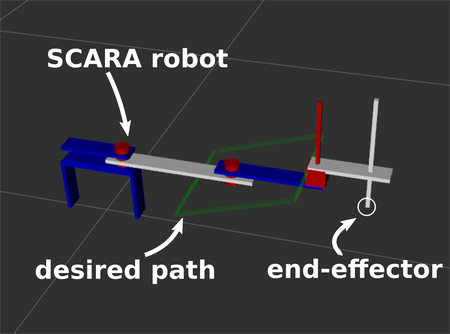

# inverse_kinematics

part of class (DD2410) work.

Implemented inverse kinematic algorithm for a robot, which will move its joints so that it follows a desired path with the end-effector. These are the robots used:

* A 3 DOF scara robot, with an inverse kinematic
* A 7 DOF kuka robot, with the inverse kinematic

[LINK TO SIMULATION VIDEO](https://www.youtube.com/watch?v=V5xQYo_gMcw)
